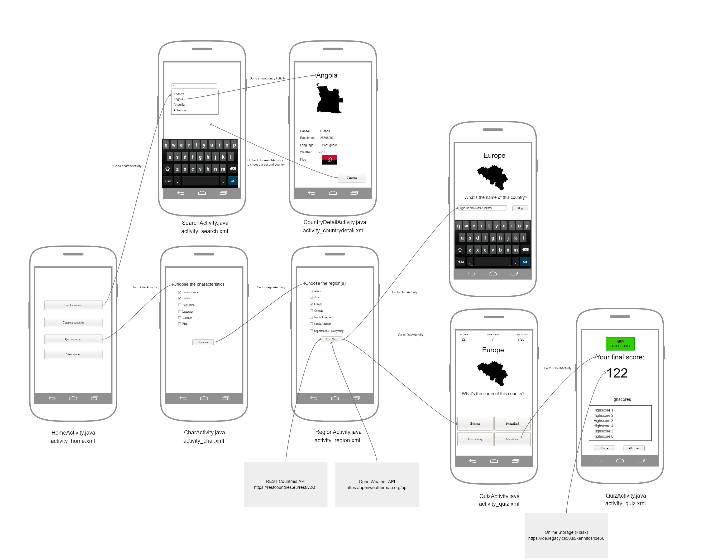
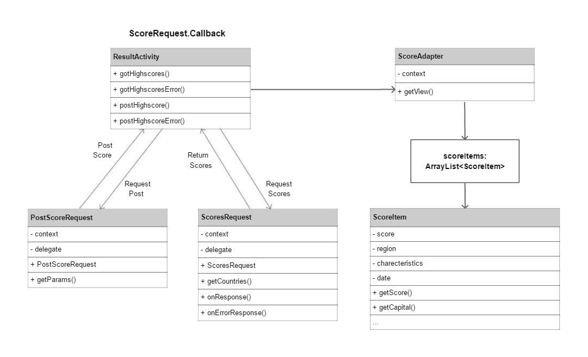

# Design application

## Advanced sketches

## Diagram of utility modules, classes and functions

## APIs and frameworks or plugins
- REST Countries API [link](https://restcountries.eu/)
- Open Weather API [link](https://openweathermap.org/api)

## Data sources 
- Maps of each individual country [link](https://github.com/djaiss/mapsicon)
  The maps are png files and are stored on an unique link. The link is based on their region, official two-letter country codes (defined in ISO 3166-1) and file size.
Those three characteristics can be derived from the REST Countries API. The links will have the following structure:
> https://raw.githubusercontent.com/djaiss/mapsicon/master/{region}/{iso}/{size}.png

For example https://raw.githubusercontent.com/djaiss/mapsicon/master/europe/nl/1024.png

## Database tables and fields (and their types)
I'm not using any at the moment
