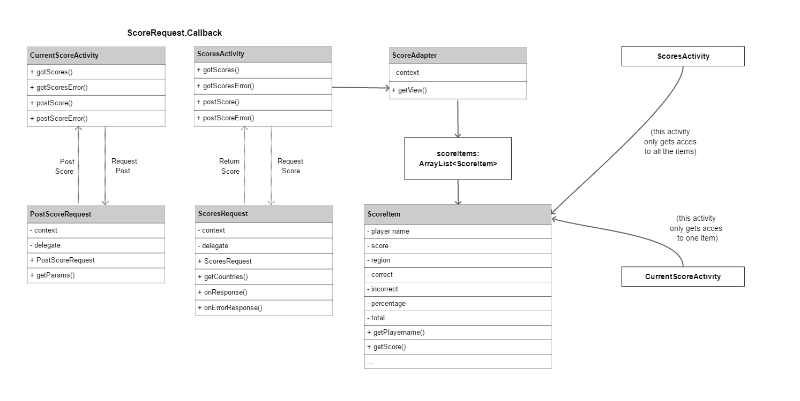

# Report

## Short description
This application lets the user search for the characteristics of a country, compare those to other countries and provides a quiz for those characteristics. The characteristics contain the name, capital, continent, region, population, area, weather and language.
 

## Technical design

## Advanced sketches

## Diagram of utility modules, classes and functions

### APIs and frameworks or plugins
- REST Countries API [link](https://restcountries.eu/)
- Open Weather API [link](https://openweathermap.org/api)

### Data sources 
- Maps of each individual country [link](https://github.com/djaiss/mapsicon)
  The maps are png files and are stored on an unique link. The link is based on their region, official two-letter country codes (defined in ISO 3166-1) and file size.
Those three characteristics can be derived from the REST Countries API. The links will have the following structure:
> https://raw.githubusercontent.com/djaiss/mapsicon/master/{region}/{iso}/{size}.png

For example https://raw.githubusercontent.com/djaiss/mapsicon/master/europe/nl/1024.png

- Wikipedia images for the map of countries
The new datasource use MD5 encrytion for the string "{county_name}\_in\_{region}.svg" and uses the first two letters of that encryption:
> https://upload.wikimedia.org/wikipedia/commons/thumb/{first}/{first_two}/{country}_in_{region}.svg/{size}-{country}_in_{region}.svg.png

For example https://upload.wikimedia.org/wikipedia/commons/thumb/6/6f/Netherlands_in_Europe.svg/1051px-Netherlands_in_Europe.svg.png

- Flags of countries were provide by the site: https://www.countryflags.io. This datasource is based on the official two-letter country codes (defined in ISO 3166-1), the style of the flag and file size.
> https://www.countryflags.io/{iso}/{style}/{size}.png

For example https://www.countryflags.io/be/flat/64.png

### Database tables and fields (and their types)
I’m using the rester server

## Process / challenges
..
